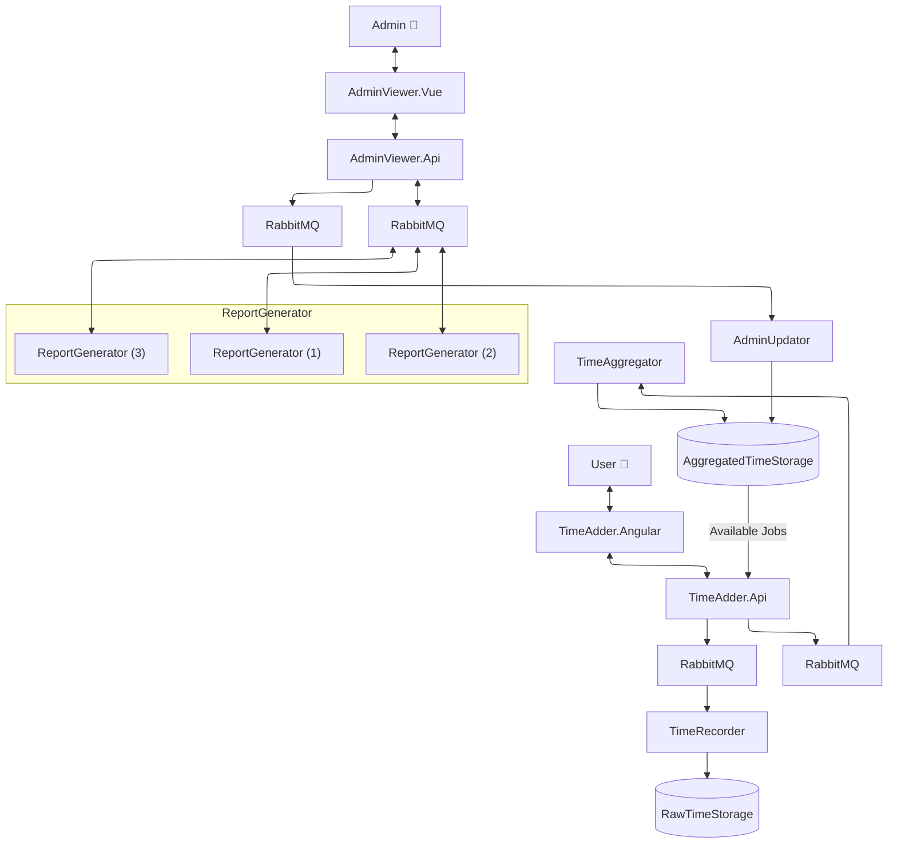

# Timesheets

An over-engineered microservice-based timesheet application using .NET Aspire.

```mermaid
%%{init: {"flowchart": {"defaultRenderer": "elk"}} }%%
graph TD
u1["User 👤"] <--> TimeAdder.Angular
TimeAdder.Angular <--> TimeAdder.Api
TimeAdder.Api --> r1[RabbitMQ]
r1 --> TimeRecorder
TimeAdder.Api --> r2[RabbitMQ]
r2 --> TimeAggregator
TimeRecorder --> db1[(RawTimeStorage)]
TimeAggregator --> db2[(AggregatedTimeStorage)]

u2["Admin 👤"] <--> AdminViewer.Vue
AdminViewer.Vue <--> AdminViewer.Api
AdminViewer.Api --> r3[RabbitMQ]
r3 --> AdminUpdator
AdminUpdator --> db2

db2 --> |Available Jobs| TimeAdder.Api

subgraph ReportGenerator
    rg1["ReportGenerator (1)"]
    rg2["ReportGenerator (2)"]
    rg3["ReportGenerator (3)"]
end

AdminViewer.Api <--> RabbitMQ
RabbitMQ <--> rg1
RabbitMQ <--> rg2
RabbitMQ <--> rg3
```
