# Timesheets

An over-engineered microservice-based timesheet application using .NET Aspire.

```mermaid
%%{init: {"flowchart": {"defaultRenderer": "elk"}} }%%
graph TD

subgraph ".NET Aspire"

appdbm["Database.MigrationService #"]

uweb1["TimeAdder.Angular 🌐"] <--> uapi1["TimeAdder.Api #"]
uapi1 --> ur1["RabbitMQ 🏭"]

subgraph "TimeRecorder Instances"
    app1a["TimeRecorder (1) #"]
    app1b["TimeRecorder (2) #"]
end

ur1 --> app1a
ur1 --> app1b
ur1 -----> app2["TimeAggregator #"]

app1a --> db1[("RawTimeStorage 🛢")]
app1b --> db1[("RawTimeStorage 🛢")]
app2 --> db2[("AggregatedTimeStorage 🛢")]

aweb1["AdminViewer.Vue 🌐"] <--> aapi1["AdminViewer.Api #"]
aapi1 --> ar1["RabbitMQ 🏭"]
ar1 --> app3["AdminUpdator #"]
app3 -----> |Setup users and Jobs| db2

db2 --> |Available Jobs| uapi1

subgraph "ReportGenerator Instances"
    rg1["ReportGenerator (1) #"]
    rg2["ReportGenerator (2) #"]
    rg3["ReportGenerator (3) #"]
end

aapi1 <--> r3["RabbitMQ 🏭"]
r3 <--> rg1
r3 <--> rg2
r3 <--> rg3

db2 --> fa1["EmailGenerator 🗲"]
fa1 --> m1["MailKit ✉"]

db1 --> fa2["NightlyCleanup 🗲"]
fa2 --> app2

end
u1["User 👤"] --> uweb1
u2["Admin 👤"] --> aweb1
```

|Key|Description|
|---|---|
|👤|User|
|🌐|SPA web application|
|#|C# web API or console app|
|🗲|Azure function app|
|🏭|RabbitMQ AMQP messaging|
|🛢|Database|
|✉|Email server|

## Current State

* RabbitMQ configured
* *TimeAdder.API* can receive an HTTP request and then sends a message to the RabbitMQ broker
* The message is then received by both the *TimeAggregator* application and one of the replicas of the *TimeRecorder* applications
* The *RawTimeEntries* database has been initialised
